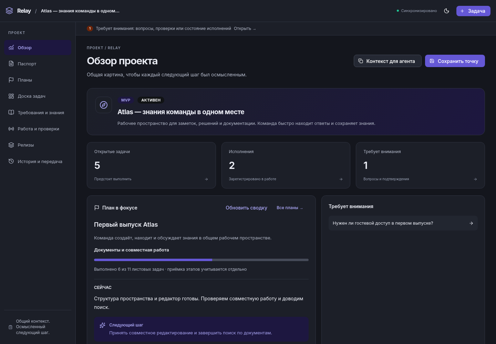
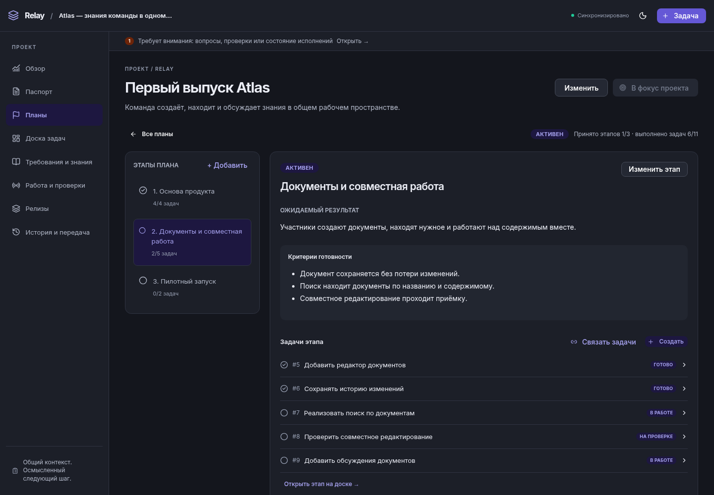

# Relay

## От замысла до релиза — вместе с AI-агентами

**Общая память проекта. Понятный план. Проверяемый результат.**

Relay объединяет цели, задачи, знания и результаты работы в одном пространстве.
Человек видит общую картину и принимает решения. Агенты получают нужный контекст,
выполняют поручения и оставляют следующему участнику точку продолжения.

[](https://www.npmjs.com/package/@gromlab/relay-cli)
[](https://www.npmjs.com/package/@gromlab/relay-server)
[](https://www.npmjs.com/package/@gromlab/relay-mcp)

[Возможности](#возможности) · [Быстрый старт](#быстрый-старт) ·
[Подключение агентов](#подключение-агентов) · [Документация](#документация)



_Общая картина проекта на одном экране. Здесь и далее — демонстрационный проект Atlas._

## AI skills

Подключите [скилл Relay](skills/relay/SKILL.md), чтобы агент мог вести проект,
получать поручения и сохранять результаты и контекст между сессиями.

```bash
npx skills add gromlab-ru/relay --skill relay
```

## Возможности

- **Смысл и контекст.** Паспорт продукта, требования, архитектурные решения и знания.
  Каждый участник понимает, что создаёт, для кого и в каких границах.

- **План, связанный с работой.** Цели, этапы, критерии приёмки и задачи с зависимостями.
  Прогресс строится по задачам, а завершение этапа фиксируется отдельной приёмкой.

- **Работа людей и агентов.** Назначения, готовые поручения, история попыток, вопросы и отчёты.
  Видно, кто выполняет задачу, что получилось и где нужна помощь.

- **Подтверждённые результаты.** Проверки с командами, окружением, коммитами и подтверждениями;
  заключения о приёмке и замечания для доработки.

- **Выпуски и развитие.** Состав релиза, установки в окружения, результаты проверки и сведения
  об откате. Баги сохраняют воспроизведение, версию и ожидаемое поведение.

- **Продолжение между сессиями.** Актуальная сводка, следующий шаг и контрольные точки.
  Новый участник получает контекст и видит, что изменилось после передачи.

### От цели — к конкретному следующему шагу

1. **Определите результат.** Сохраните назначение продукта, требования и цель ближайшего изменения.
2. **Составьте план.** Разбейте его на этапы и задачи, задайте зависимости и критерии приёмки.
3. **Организуйте исполнение.** Выдайте поручения людям или агентам своей среды, собирайте вопросы и результаты проверок.
4. **Примите и выпустите.** Зафиксируйте принятый результат, состав версии и факты установки в окружения.
5. **Продолжите с контекстом.** Сохраните достигнутое, незавершённую работу и следующий шаг.

Этот же цикл подходит для первого MVP, новой возможности и исправления бага в работающем продукте.



_Цель, этапы и задачи связаны: от общего плана можно перейти к конкретной работе._

## Быстрый старт

В каталоге своего проекта выполните две команды:

```bash
npx @gromlab/relay-cli init
npx @gromlab/relay-server --open
```

Relay откроется в браузере на **http://127.0.0.1:4700**. Заполните паспорт,
создайте план и добавьте первые задачи. Сервер уже включает готовый веб-интерфейс.

Рекомендуется **Node.js 24**; пакеты Relay поддерживают Node.js 22+.

Начиная с `0.6.0`, CLI, Server и MCP выпускаются вместе с **одинаковой версией**.
Совпадающая полная версия обозначает проверенный совместимый комплект; обновляйте все
используемые пакеты вместе. Для воспроизводимой установки указывайте её явно:
`npx @gromlab/relay-cli@0.6.0`, `npx @gromlab/relay-server@0.6.0`,
`npx @gromlab/relay-mcp@0.6.0`.

### От задачи к готовому поручению

В другом терминале, из того же каталога:

```bash
npx @gromlab/relay-cli create "Подготовить первый релиз" --actor human
npx @gromlab/relay-cli project context
npx @gromlab/relay-cli project briefing 1
```

В пустом проекте первая задача получает ID `1`; если задачи уже есть, используйте ID из ответа.
`project context` собирает общую картину, а `project briefing` — поручение по выбранной задаче
с её описанием, целью плана, требованиями и связанными знаниями.

## Подключение агентов

Запустите MCP рядом с уже работающим Relay Server:

```bash
npx @gromlab/relay-mcp --server-url http://127.0.0.1:4700
```

Добавьте **http://127.0.0.1:4710/mcp** в свой MCP-клиент как Streamable HTTP-подключение.
Агент получает доступ к тем же планам, задачам и результатам, которые человек видит в браузере.

Например, через MCP-инструменты можно запросить контекст проекта и поручение:

```text
project_context({})
task_briefing({ id: 1 })
```

**Оркестратор** ведёт план, назначает работу и принимает результаты.
**Исполнитель** получает ограниченное поручение, сохраняет ход работы, проверки и итог.
**Человек** может уточнить требования, ответить на вопрос и скорректировать следующий шаг.
Установленный скилл помогает агентам следовать этому процессу.

## Ваши данные, ваш рабочий процесс

- **Локально, рядом с кодом.** Данные хранятся в читаемых JSON-файлах в `.relay`.
  Их можно просматривать, резервировать и версионировать привычными инструментами.
  Для работы не нужны облачный аккаунт и отдельная СУБД.
- **Один проект или несколько.** Workspace объединяет независимые проекты в одном интерфейсе.
  У каждого остаются собственные цели, задачи, знания и история.
- **Общие данные во всех инструментах.** Работайте в Web, используйте CLI в терминале,
  подключайте агентов через MCP и свои инструменты через REST API.
- **Совместная работа.** Изменения появляются в интерфейсе в реальном времени.
  Авторы и история сохраняются, а проверка ревизий помогает разрешать конкурентные правки.

## Документация

- [Первый проект](docs/GETTING_STARTED.md) — запуск Relay и подключение нескольких проектов.
- [Жизненный цикл проекта](docs/guides/LIFECYCLE.md) — от планирования до выпуска и передачи.
- [Оркестрация](docs/guides/ORCHESTRATION.md) · [MCP](docs/reference/MCP.md) — работа с агентами.
- [CLI](docs/reference/CLI.md) · [REST API](docs/reference/API.md) — автоматизация и интеграции.
- [Вся документация](docs/README.md) · [Участие в разработке](docs/DEVELOPMENT.md).
