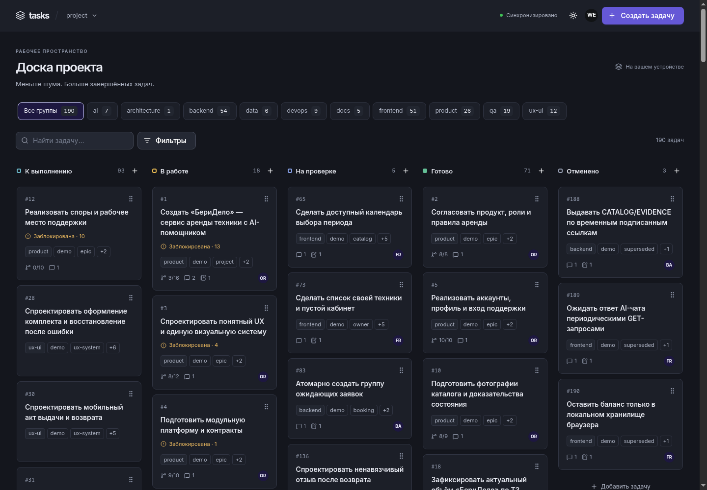

# Tasks

**Организация и оркестрация потока задач между AI-агентами на одном хосте — с локальной JSON-базой.**

[](https://www.npmjs.com/package/@gromlab/tasks-cli)
[](https://nodejs.org/)

Tasks — рабочая база задач для **оркестратора и субагентов**. Оркестратор создаёт
и назначает задачи, управляет зависимостями и статусами, контролирует и принимает результаты.
Субагент получает конкретный ID, читает контекст и записывает ход работы через CLI.
Человек наблюдает за процессом через веб-доску и при необходимости вносит дополнения.

**Одна задача — один JSON-файл с полным контекстом:** требования, связи, назначение,
обсуждение и отчёты. Данные сохраняются рядом с кодом и могут версионироваться в Git.

[Быстрый старт](#быстрый-старт) · [Возможности](#возможности) ·
[AI skill](#ai-skill) · [Документация](docs/README.md)



_Веб-доска Tasks на демонстрационном проекте: 190 задач, группы и общий прогресс._

## AI skill

```bash
npx skills add gromlab-ru/tasks-cli --skill tasks-cli
```

Для OpenCode добавьте `--agent opencode`, после установки перезапустите OpenCode.
Установщик Skills требует Node.js 22.20+, рекомендуется 24.
Скилл объясняет роли, назначение задач, чтение контекста, отчёты и восстановление.
Сам пакет запускается через `npx @gromlab/tasks-cli`.

[Содержание скилла](skills/tasks-cli/SKILL.md) · [Установка скиллов](docs/development/SKILLS.md).

## Быстрый старт

Требуется **Node.js 22+ с npm/npx**. Оркестратор подготавливает новый проект:

```bash
npx @gromlab/tasks-cli init
```

Для общей серверной базы добавьте URL в секцию `server` созданного `tasks.config.json`:

```json
{ "server": { "port": 3000, "url": "http://127.0.0.1:3000" } }
```

Это фрагмент конфига; остальные поля сохраняются. Затем оркестратор запускает доску:

```bash
npx @gromlab/tasks-cli server --actor human --open
```

Доска откроется на **http://127.0.0.1:3000**. `human` подписывает дополнения из UI.
Сервер работает до `Ctrl+C`; следующие команды выполняются в другом терминале.
CLI сам читает URL из конфига и обращается к API. Без URL он работает с локальной базой.
Подробнее: [первый проект](docs/GETTING_STARTED.md).

## Возможности

| Возможность                     | Для чего нужна                                                                                  |
| ------------------------------- | ----------------------------------------------------------------------------------------------- |
| **Локальная JSON-база**         | Хранить задачи и их контекст рядом с кодом, просматривать изменения в Git                       |
| **Управление оркестратором**    | Создавать задачи и подзадачи, назначать исполнителей, управлять зависимостями и статусами       |
| **Контекст для субагентов**     | Передавать конкретный ID с требованиями, связями, текущим состоянием и историей                 |
| **Автоматическое подключение**  | Использовать API по URL из конфига или локальные операции, без настройки коннекта субагентами   |
| **Отчёты и продолжение работы** | Сохранять действия, решения, проверки и следующий шаг между сессиями                            |
| **Наблюдение через UI**         | Видеть работу агентов, читать результаты и при необходимости дополнять задачи                   |
| **Обзор проекта**               | Контролировать прогресс, готовую работу, проверку и влияние блокеров                            |
| **CLI и REST API**              | Автоматизировать операции, читать JSON, использовать ревизии, страницы и SSE                    |
| **Несколько проектов**          | Выбирать проект по имени из общего `tasks.orchestrator.json`                                    |
| **Общий MCP-сервер**            | Подключать оркестратора и субагентов к одному HTTP-адресу с обновлением реестра без перезапуска |

## Один или несколько проектов и MCP

Для одной базы CLI и MCP находят `tasks.config.json` от каталога запуска или получают
его через `--config`. Для нескольких баз создайте `tasks.orchestrator.json` с именами,
путями к проектам и необязательными URL REST API:

```json
{
  "version": 1,
  "projects": {
    "frontend": { "path": "../frontend" },
    "backend": { "path": "../backend" }
  }
}
```

Каждый каталог содержит проектный конфиг. Из корня оркестратора:

```bash
npx @gromlab/tasks-cli backend list
npx @gromlab/tasks-cli frontend get 1
npx @gromlab/tasks-mcp
```

Отдельный пакет **`@gromlab/tasks-mcp`** запускает Streamable HTTP на
`http://127.0.0.1:3010/mcp`. Все агенты используют один адрес и инструменты вида
`task_get({ project: "backend", id: 1 })`. При прямом проектном конфиге поле `project`
опускается. MCP читает изменения реестра без перезапуска и сохраняет регистрации
через `project_register`/`project_unregister` в общий файл.

Все MCP-операции задач проходят через REST SDK. Если URL проекта отсутствует,
MCP автоматически поднимает локальный API на свободном порту.
[Два вида конфигурации](docs/reference/CONFIGURATION.md) · [Справочник MCP](docs/reference/MCP.md).

## Работа из терминала

Оркестратор создаёт и назначает задачу. В новой базе она получит ID `1`:

```bash
npx @gromlab/tasks-cli create "Подготовить API проекта" --group backend --actor orchestrator
npx @gromlab/tasks-cli update 1 --assignee backend-agent --status in_progress --actor orchestrator
```

Субагент получает ID и имя автора. Конфиг уже находится в его рабочем каталоге:

```bash
npx @gromlab/tasks-cli get 1 --format json
npx @gromlab/tasks-cli log add 1 --actor backend-agent --kind decision \
  --text "Контракт API согласован. Следующий шаг — реализация обработчика."
npx @gromlab/tasks-cli update 1 --summary "Обработчик готов, осталось проверить ошибки" --actor backend-agent
```

После отчёта субагента оркестратор проводит проверку и меняет статус:

```bash
npx @gromlab/tasks-cli status 1 review --actor orchestrator
npx @gromlab/tasks-cli overview
```

Субагент не выбирает задачи из очереди и не вызывает `claim`: выбор, назначение,
передача и завершение принадлежат оркестратору.
[Полный жизненный цикл](docs/guides/WORKFLOW.md).

## Работа агентов

Оркестратор, сервер и субагенты работают **на одном хосте**. Оркестратор обеспечивает
запуск сервера и конфиг с его URL в рабочих копиях, включая отдельные Git worktree.
CLI субагента автоматически использует API, а сервер сохраняет изменения в JSON-базе оркестратора.

```text
Оркестратор → создаёт и назначает задачу → субагент получает ID
Субагент → читает контекст и пишет отчёты → оркестратор проверяет результат
Человек → наблюдает через UI и при необходимости добавляет уточнения
```

`server.url` включает HTTP; без него операции локальные. `server.port` определяет
порт запуска сервера. Переменные и флаги подключения доступны как дополнительные
переопределения, а не обязательный шаг работы агента.

Для повторяемых отчётов есть `--request-id`. При недоступном сервере CLI сообщает
ошибку; оркестратор может восстановить доступ или явно использовать `--local`
с центральным конфигом. [Оркестрация и восстановление](docs/guides/ORCHESTRATION.md).

## Данные и интеграции

```text
ваш-проект/
├── tasks.config.json
└── .tasks/
    ├── 1.json
    └── 2.json
```

Ревизии и общая блокировка защищают записи в одном хранилище при параллельных изменениях.
CLI поддерживает выбор полей и JSON-вывод; сервер предоставляет API на `/api/v1`,
Swagger на `/api/docs`, OpenAPI на `/api/openapi.json` и обновления доски через SSE.

[Модель задач](docs/concepts/TASKS.md) · [Git и worktree](docs/guides/GIT.md) ·
[Автоматизация](docs/guides/AUTOMATION.md).

## Документация

| Что хотите сделать             | Где прочитать                                                             |
| ------------------------------ | ------------------------------------------------------------------------- |
| Начать пользоваться            | [Первый проект](docs/GETTING_STARTED.md)                                  |
| Найти команду или параметр     | [Справочник CLI](docs/reference/CLI.md)                                   |
| Организовать работу агентов    | [Оркестрация](docs/guides/ORCHESTRATION.md)                               |
| Наблюдать за работой           | [Веб-доска](docs/guides/WEB.md)                                           |
| Настроить проект и подключение | [Конфигурация](docs/reference/CONFIGURATION.md)                           |
| Подключить инструмент          | [REST API](docs/reference/API.md), [JSON-вывод](docs/reference/OUTPUT.md) |
| Подключить агентов по MCP      | [MCP](docs/reference/MCP.md)                                              |
| Разобраться с ошибкой          | [Диагностика](docs/TROUBLESHOOTING.md)                                    |
| Развивать проект               | [Разработка](docs/DEVELOPMENT.md)                                         |

[Вся документация](docs/README.md) · [История изменений](apps/cli/CHANGELOG.md) ·
[Сообщить о проблеме](https://github.com/gromlab-ru/tasks-cli/issues)
